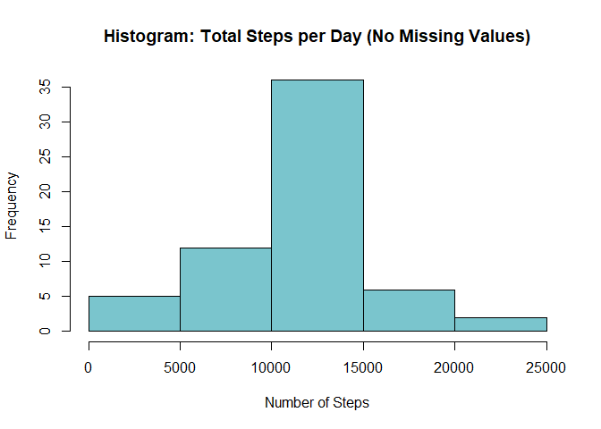

## Loading and preprocessing the data
We first take steps to load the data.

```r
setwd("C:/Users/shrut/datasciencecoursera/Reproducible_Research/Project_1")
raw_activity_data <- read.csv("data/activity.csv", header = TRUE, stringsAsFactors = FALSE)
head(raw_activity_data)
```

```
##   steps       date interval
## 1    NA 2012-10-01        0
## 2    NA 2012-10-01        5
## 3    NA 2012-10-01       10
## 4    NA 2012-10-01       15
## 5    NA 2012-10-01       20
## 6    NA 2012-10-01       25
```

We change the date field.

```r
raw_activity_data$date <- as.POSIXct(raw_activity_data$date, format = "%Y-%m-%d")
```

## What is mean total number of steps taken per day?
We first subset to a dataset with non-missing values and then determine the total number of steps taken per day.

```r
activity_data <- subset(raw_activity_data, !is.na(raw_activity_data$steps))
total_data <- aggregate(steps ~ date, activity_data, sum)
names(total_data) <- c("date", "total_steps")
head(total_data)
```

```
##         date total_steps
## 1 2012-10-02         126
## 2 2012-10-03       11352
## 3 2012-10-04       12116
## 4 2012-10-05       13294
## 5 2012-10-06       15420
## 6 2012-10-07       11015
```

A histogram was created to illustrate the total number of steps.

```r
hist(total_data$total_steps, col = "cadetblue3", xlab = "Number of Steps", 
     main = "Histogram: Total Steps per Day")
```

<!-- -->

We then found the mean and median number of steps.

```r
mean(total_data$total_steps)
```

```
## [1] 10766.19
```

```r
median(total_data$total_steps)
```

```
## [1] 10765
```

## What is the average daily activity pattern?
We first determined the avg number of steps across all days.

```r
avg_data <- aggregate(steps ~ interval, activity_data, mean)
names(avg_data) <- c("interval", "average")
head(avg_data)
```

```
##   interval   average
## 1        0 1.7169811
## 2        5 0.3396226
## 3       10 0.1320755
## 4       15 0.1509434
## 5       20 0.0754717
## 6       25 2.0943396
```

We then generated a time series plot.

```r
plot(avg_data$interval, avg_data$average, type = "l", col = "cadetblue3",
     lwd = 2, xlab = "Interval in Minutes", ylab = "Avg Steps",
     main = "Average Steps per Interval")
```

<!-- -->

We found the interval with the maximum number of steps.

```r
maximum <- which(avg_data$average == max(avg_data$average))
max_interval <- avg_data[maximum, 1]
print(max_interval)
```

```
## [1] 835
```

## Imputing missing values
We first found the count of missing values.

```r
missing_count <- sum(is.na(raw_activity_data$steps))
print(missing_count)
```

```
## [1] 2304
```

We then imputed missing values with the median.

```r
missing_rows <- which(is.na(raw_activity_data$steps))
avg <- rep(mean(raw_activity_data$steps, na.rm= TRUE), times = length(missing_rows))
raw_activity_data[missing_rows, "steps"] <- avg
```

A histogram was created below.

```r
total_data_nm <- aggregate(raw_activity_data$steps, by = list(raw_activity_data$date),
                        FUN = sum)
names(total_data_nm) <- c("date", "total_steps")
head(total_data_nm)
```

```
##         date total_steps
## 1 2012-10-01    10766.19
## 2 2012-10-02      126.00
## 3 2012-10-03    11352.00
## 4 2012-10-04    12116.00
## 5 2012-10-05    13294.00
## 6 2012-10-06    15420.00
```

```r
hist(total_data_nm$total_steps, col = "cadetblue3", xlab = "Number of Steps", 
     main = "Histogram: Total Steps per Day (No Missing Values)")
```

<!-- -->

The mean and median were then determined.

```r
mean(total_data_nm$total_steps)
```

```
## [1] 10766.19
```

```r
median(total_data_nm$total_steps)
```

```
## [1] 10766.19
```

## Are there differences in activity patterns between weekdays and weekends?
We first added labels of weekdays and weekends.

```r
raw_activity_data <- data.frame(date = raw_activity_data$date,
                                weekday = tolower(weekdays(raw_activity_data$date)),
                                steps = raw_activity_data$steps,
                                interval = raw_activity_data$interval)
raw_activity_data <- cbind(raw_activity_data,
                           daytype = ifelse(raw_activity_data$weekday == "saturday" |
                                              raw_activity_data$weekday == "sunday", "weekend", "weekday"))
activity_data_labels <- data.frame(date = raw_activity_data$date,
                                   weekday = raw_activity_data$weekday,
                                   daytype = raw_activity_data$daytype,
                                   interval = raw_activity_data$interval,
                                   steps = raw_activity_data$steps)
```

We then created a plot.

```r
library(lattice)
avg_data_labels <- aggregate(activity_data_labels$steps, by = list(activity_data_labels$daytype,
                                                                    activity_data_labels$weekday,
                                                                   activity_data_labels$interval), mean)
names(avg_data_labels) <- c("Day_Type", "Weekday", "Interval", "Avg")

xyplot(Avg ~ Interval | Day_Type, avg_data_labels, type = "l", lwd = 1,
       xlab = "Interval", ylab = "Number of Steps", layout = c(1,2))
```

<!-- -->
